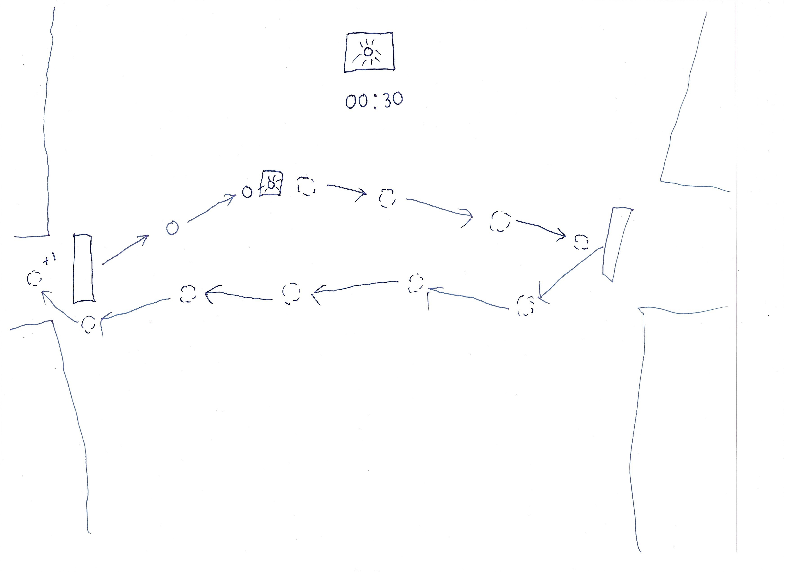
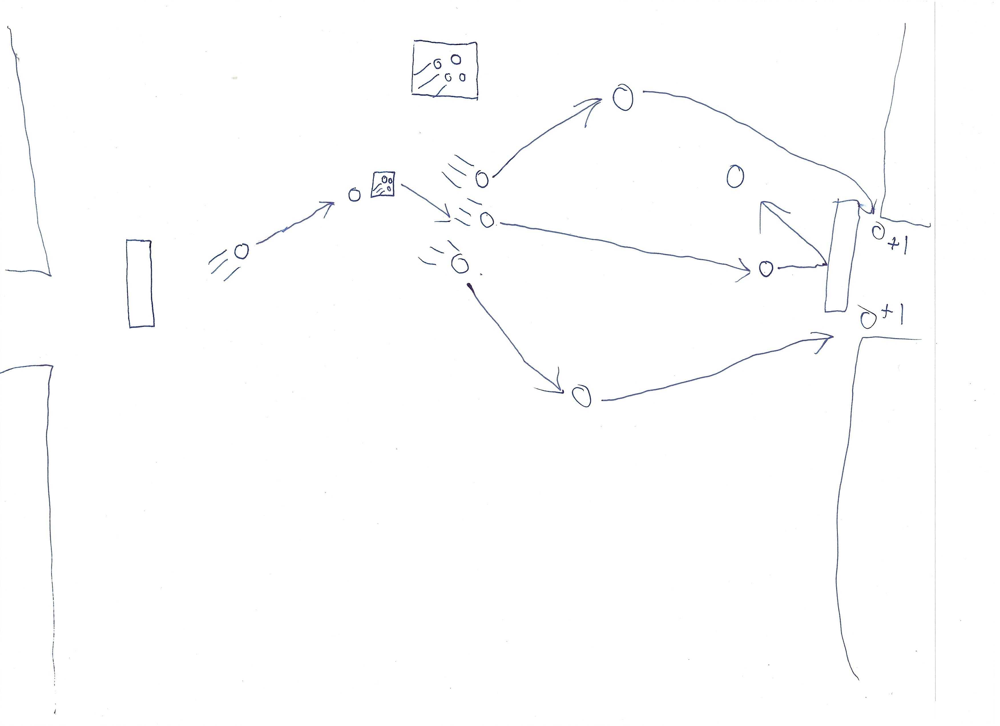
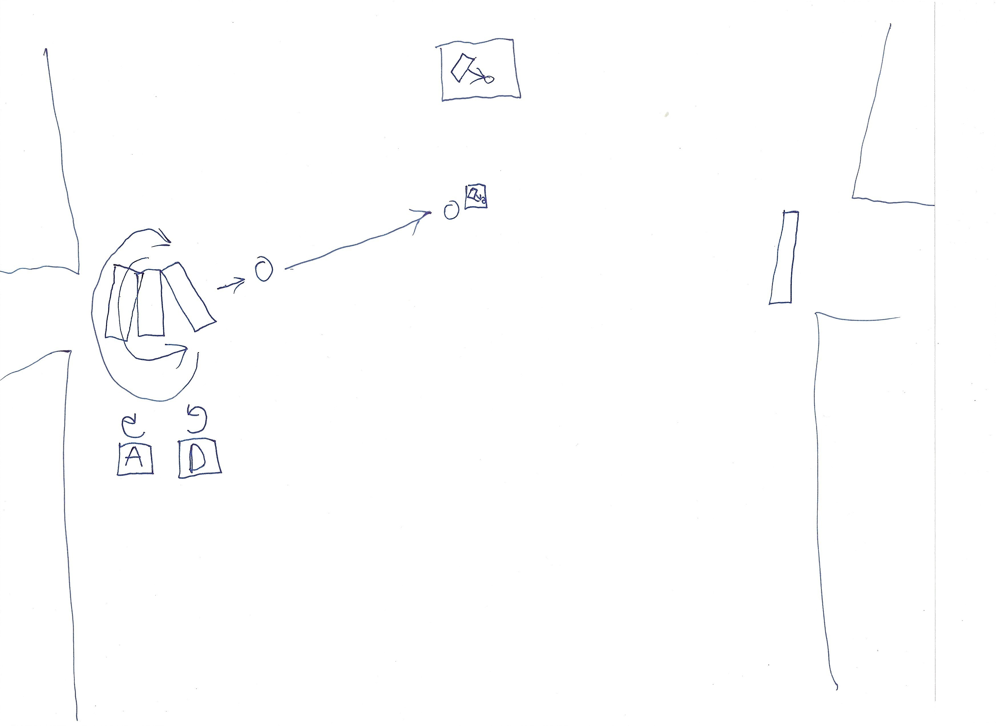
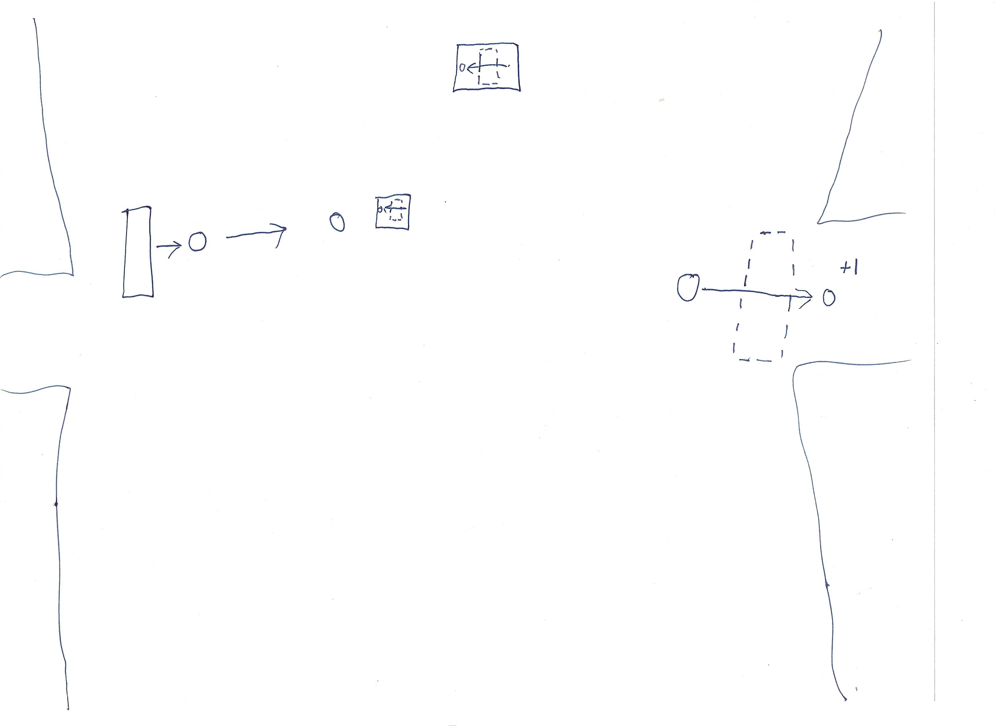
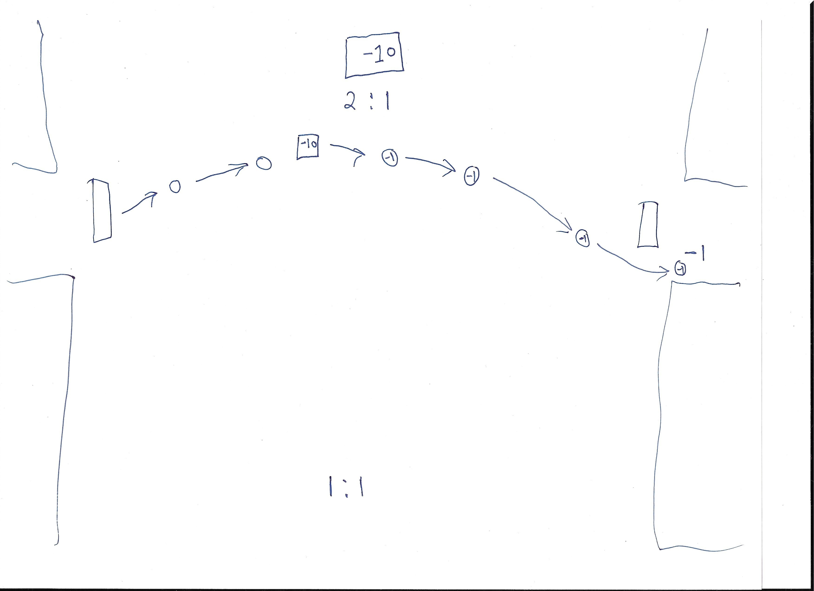

# Make a Thing

**Author:** Alexandre Casanova-Frascarella  
**Student ID:** 40207805

## Design Process Overview

My process for developing an idea for this game prototype began when I was introduced to Game Boy Studio in class. As a big Nintendo fan, I was immediately intrigued by software that makes it accessible to develop Game Boy–style games. I knew right away that I wanted to create a Game Boy game of my own. However, since I had never used Game Boy Studio before, my first step was to watch an online tutorial to learn the basics of the engine.

## Learning Tools and Assets

While watching the tutorial, I learned two important things related to pixel art. The first was the existence of Aseprite, a pixel art creation tool that integrates very well with Game Boy Studio. This interested me because it allowed me to experiment with a new piece of software alongside the game engine itself. The second thing I learned was a common technique used by developers who are not primarily pixel artists: downloading free or paid pixel art assets online and modifying them in Aseprite to better fit a game’s style and needs.

Using this approach, I visited itch.io and downloaded a variety of free pixel art assets. Browsing through these different sprites helped me decide what kind of game I wanted to create. One of the sprites I found was a small, cute fox, and I realized that it had been a while since I had seen a video game with an adorable animal mascot as the main playable character. Because of this, I decided to develop a simple platformer starring the fox.

## Level Design and Mechanics

After choosing the main character, I reviewed the other assets I had downloaded and began creating level art by combining them into a single scene. I decided to set the game in a forest environment to match the fox character, but I intentionally used darker, more ominous décor to contrast with the fox’s cute appearance.

I then implemented familiar platformer mechanics, such as jumping on enemies and collecting coins. While the coins function as basic collectibles, their placement within the level adds strategic value and helps guide player movement.

## Narrative and Atmosphere

The inclusion of enemies also contributes to the game’s darker atmosphere and world-building. I believe this allows players to create their own head-canon about what may have happened in the forest based on its tone and visual design.

Finally, after discovering a visually striking sword sprite, I decided to make collecting the sword the primary goal of the game. The narrative idea is that the fox must travel through the forest to retrieve the sword and defeat the remaining monsters. Although the game currently ends once the fox collects the sword, this concept could be expanded further in a future, more complete build.

# Exploration Prototype 1

For my second exploration prototype, I followed a beginner Unity tutorial from the YouTube channel _Game Maker’s Toolkit_. The tutorial emphasized that while Unity is a beginner-friendly engine, it is most effective when its core concepts are understood first.

It introduced the Unity Editor layout, highlighting the importance of navigating the **Scene**, **Game**, **Hierarchy**, and **Inspector** panels. The video demonstrated how **GameObjects** and **Components** form the foundation of all elements within Unity, and how **Transforms**, **Colliders**, and **Scripts** work together to define object behaviour and interaction.

The tutorial guided viewers through creating a simple Flappy Bird–style game, reinforcing the idea that starting with small projects is an effective way to learn Unity. Through this process, I learned how to:

- Link C# scripts to game object attributes
- Trigger events
- Spawn and despawn objects
- Implement a basic game-over screen
- Gain confidence in using C# without needing to master the language immediately

## Screenshots

## Reference

Game Maker’s Toolkit. _The Unity Tutorial For Complete Beginners._ YouTube video, 46:39, December 2, 2022. [https://www.youtube.com/watch?v=XtQMytORBmM](https://www.youtube.com/watch?v=XtQMytORBmM&utm_source=chatgpt.com)

# Exploration Prototype 2

## Overview
For the second prototype exploration, I investigated **role prototyping**, with elements of **look-and-feel prototyping**, though the design emphasis remained primarily on *role* within the prototyping triangle. Building on the previous class discussion about implementing **Pong**, I focused on conceptualizing a set of **power-up mechanics** to extend the game’s core dynamics.

## Power-Up System Rules
- Power-ups spawn on the playing field at **fixed intervals**.
- When the ball collides with a power-up, the effect is granted to the **player whose paddle last touched the ball**.
- Power-ups are visually represented as **medium-sized squares** with a **central icon** that clearly communicates their function.
- Each power-up remains active **only until a point is scored**.
- When the game state resets and the ball respawns at the center, **all active effects are removed**.
- Only **one power-up** may exist on the field at a time.
- Each power-up remains available for **10 seconds** before a new one spawns.
- For the power-ups to be most effective, the scoring zone of each player has to be minimized. 

## Power-Up Designs

### Invisible Ball
The *Invisible Ball* power-up makes the ball invisible to both players for a limited time. During this effect, players must rely on **memory** and **trajectory prediction** to intercept the ball. This mechanic introduces uncertainty and heightened tension into gameplay.

> **Design note:** The initially proposed duration of 30 seconds may be excessive given Pong’s fast-paced nature and may require adjustment.
> 

### Scatter Shot
*Scatter Shot* multiplies the ball into **three simultaneous, fully active balls**.

- All three balls can score points.
- No distinction is made between real or decoy balls.
- If multiple balls enter a goal, **each successfully scores a point**.

This power-up dramatically increases both the **intensity** and **complexity** of gameplay. The effect ends once **all three balls have been scored** in either goal.

### Rotating Paddle
The *Rotating Paddle* power-up allows the player to rotate their paddle up to **180 degrees**. This enables more precise shot angles and introduces the possibility of adding velocity through rotational movement.

- Players using **W/S** for movement rotate with **A/D**.
- Players using **arrow keys** rotate using **left/right arrows**.

While this mechanic adds significant mechanical depth, it also increases **cognitive and motor demands**, making control more complex.

### Vanishing Paddle
The *Vanishing Paddle* power-up temporarily removes the **opponent’s paddle** from the field for **five seconds**, giving the activating player an unobstructed opportunity to score.

### Minus-One Ball
The *Minus-One Ball* reverses the game’s scoring logic.

- Scoring with this ball **subtracts one point** instead of adding one.
- Players may intentionally score on their **own goal** to reduce their opponent’s score.
- Scoring against oneself subtracts a point from the opponent.
- Scoring against the opponent subtracts a point from the player.

This power-up was intentionally designed as an **adverse effect** to prevent balance issues. Allowing players to reduce an opponent’s score without risk would be overly powerful and potentially unfair.

