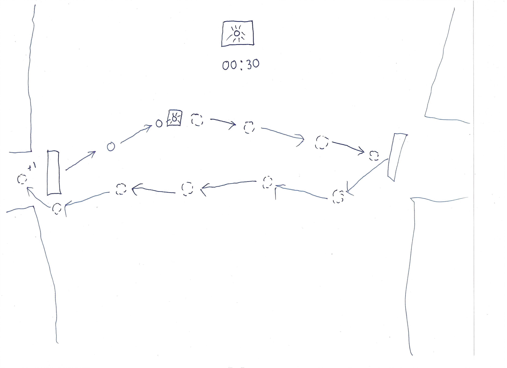
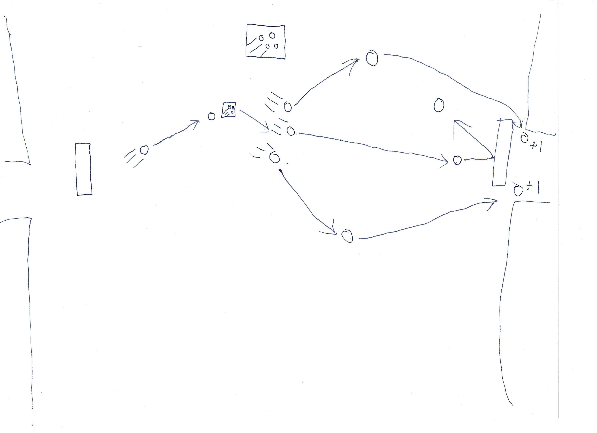
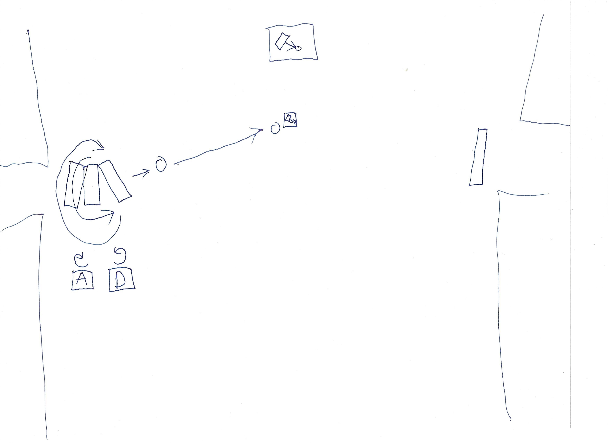
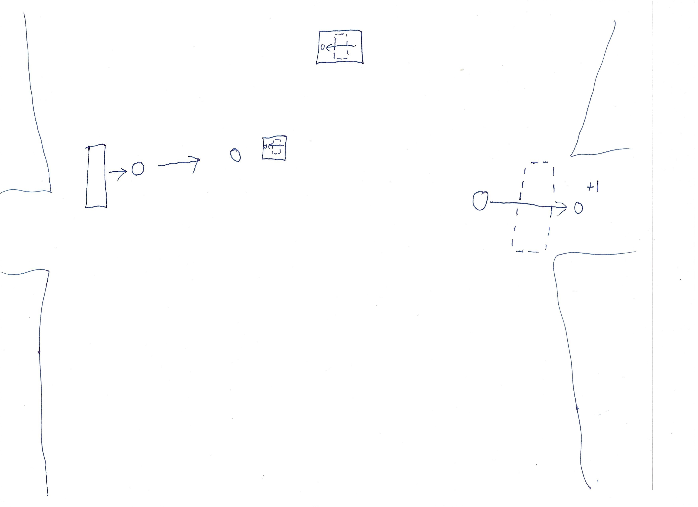
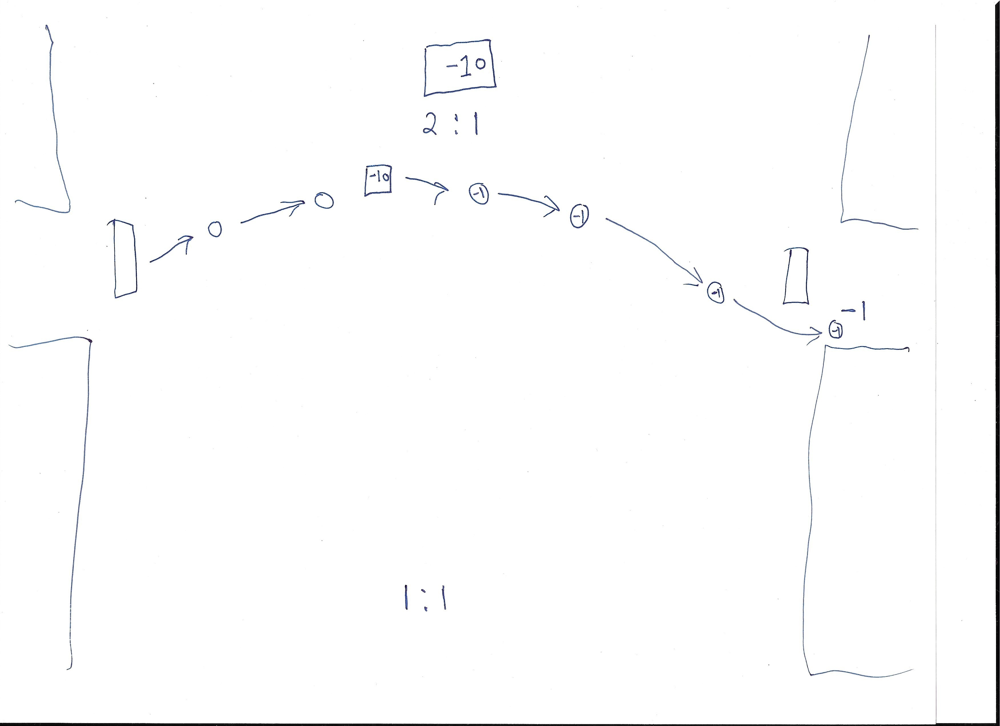
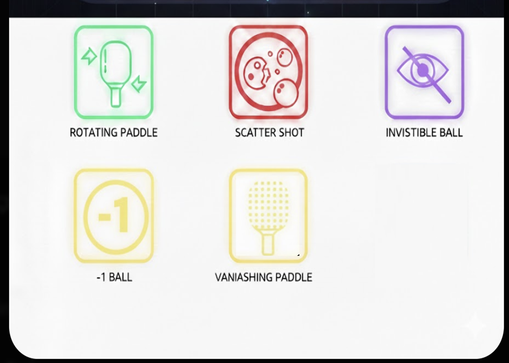
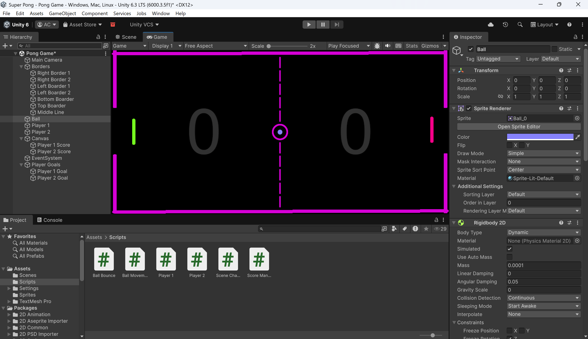
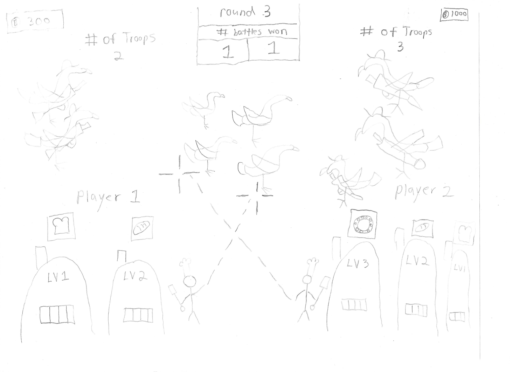

# Make a Thing

**Author:** Alexandre Casanova-Frascarella  
**Student ID:** 40207805

## Design Process Overview

My process for developing an idea for this game prototype began when I was introduced to Game Boy Studio in class. As a big Nintendo fan, I was immediately intrigued by software that makes it accessible to develop Game Boy–style games. I knew right away that I wanted to create a Game Boy game of my own. However, since I had never used Game Boy Studio before, my first step was to watch an online tutorial to learn the basics of the engine.

## Learning Tools and Assets

While watching the tutorial, I learned two important things related to pixel art. The first was the existence of Aseprite, a pixel art creation tool that integrates very well with Game Boy Studio. This interested me because it allowed me to experiment with a new piece of software alongside the game engine itself. The second thing I learned was a common technique used by developers who are not primarily pixel artists: downloading free or paid pixel art assets online and modifying them in Aseprite to better fit a game’s style and needs.

Using this approach, I visited itch.io and downloaded a variety of free pixel art assets. Browsing through these different sprites helped me decide what kind of game I wanted to create. One of the sprites I found was a small, cute fox, and I realized that it had been a while since I had seen a video game with an adorable animal mascot as the main playable character. Because of this, I decided to develop a simple platformer starring the fox.

## Level Design and Mechanics

After choosing the main character, I reviewed the other assets I had downloaded and began creating level art by combining them into a single scene. I decided to set the game in a forest environment to match the fox character, but I intentionally used darker, more ominous décor to contrast with the fox’s cute appearance.

I then implemented familiar platformer mechanics, such as jumping on enemies and collecting coins. While the coins function as basic collectibles, their placement within the level adds strategic value and helps guide player movement.

## Narrative and Atmosphere

The inclusion of enemies also contributes to the game’s darker atmosphere and world-building. I believe this allows players to create their own head-canon about what may have happened in the forest based on its tone and visual design.

Finally, after discovering a visually striking sword sprite, I decided to make collecting the sword the primary goal of the game. The narrative idea is that the fox must travel through the forest to retrieve the sword and defeat the remaining monsters. Although the game currently ends once the fox collects the sword, this concept could be expanded further in a future, more complete build.


# Exploration Prototype 1

For my second exploration prototype, I followed a beginner Unity tutorial from the YouTube channel _Game Maker’s Toolkit_. The tutorial emphasized that while Unity is a beginner-friendly engine, it is most effective when its core concepts are understood first.

It introduced the Unity Editor layout, highlighting the importance of navigating the **Scene**, **Game**, **Hierarchy**, and **Inspector** panels. The video demonstrated how **GameObjects** and **Components** form the foundation of all elements within Unity, and how **Transforms**, **Colliders**, and **Scripts** work together to define object behaviour and interaction.

The tutorial guided viewers through creating a simple Flappy Bird–style game, reinforcing the idea that starting with small projects is an effective way to learn Unity. Through this process, I learned how to:

- Link C# scripts to game object attributes
- Trigger events
- Spawn and despawn objects
- Implement a basic game-over screen
- Gain confidence in using C# without needing to master the language immediately

## Screenshots


## Reference

Game Maker’s Toolkit. _The Unity Tutorial For Complete Beginners._ YouTube video, 46:39, December 2, 2022. [https://www.youtube.com/watch?v=XtQMytORBmM](https://www.youtube.com/watch?v=XtQMytORBmM&utm_source=chatgpt.com)

# Exploration Prototype 2

## Overview
For the second prototype exploration, I investigated **role prototyping**, with elements of **look-and-feel prototyping**, though the design emphasis remained primarily on *role* within the prototyping triangle. Building on the previous class discussion about implementing **Pong**, I focused on conceptualizing a set of **power-up mechanics** to extend the game’s core dynamics.

## Power-Up System Rules
- Power-ups spawn on the playing field at **fixed intervals**.
- When the ball collides with a power-up, the effect is granted to the **player whose paddle last touched the ball**.
- Power-ups are visually represented as **medium-sized squares** with a **central icon** that clearly communicates their function.
- Each power-up remains active **only until a point is scored**.
- When the game state resets and the ball respawns at the center, **all active effects are removed**.
- Only **one power-up** may exist on the field at a time.
- Each power-up remains available for **10 seconds** before a new one spawns.
- For the power-ups to be most effective, the scoring zone of each player has to be minimized. 

## Power-Up Designs

### Invisible Ball
The *Invisible Ball* power-up makes the ball invisible to both players for a limited time. During this effect, players must rely on **memory** and **trajectory prediction** to intercept the ball. This mechanic introduces uncertainty and heightened tension into gameplay.

> **Design note:** The initially proposed duration of 30 seconds may be excessive given Pong’s fast-paced nature and may require adjustment.
> 

### Scatter Shot
*Scatter Shot* multiplies the ball into **three simultaneous, fully active balls**.

- All three balls can score points.
- No distinction is made between real or decoy balls.
- If multiple balls enter a goal, **each successfully scores a point**.

This power-up dramatically increases both the **intensity** and **complexity** of gameplay. The effect ends once **all three balls have been scored** in either goal.


### Rotating Paddle
The *Rotating Paddle* power-up allows the player to rotate their paddle up to **180 degrees**. This enables more precise shot angles and introduces the possibility of adding velocity through rotational movement.

- Players using **W/S** for movement rotate with **A/D**.
- Players using **arrow keys** rotate using **left/right arrows**.

While this mechanic adds significant mechanical depth, it also increases **cognitive and motor demands**, making control more complex.


### Vanishing Paddle
The *Vanishing Paddle* power-up temporarily removes the **opponent’s paddle** from the field for **five seconds**, giving the activating player an unobstructed opportunity to score.


### Minus-One Ball
The *Minus-One Ball* reverses the game’s scoring logic.

- Scoring with this ball **subtracts one point** instead of adding one.
- Players may intentionally score on their **own goal** to reduce their opponent’s score.
- Scoring against oneself subtracts a point from the opponent.
- Scoring against the opponent subtracts a point from the player.

This power-up was intentionally designed as an **adverse effect** to prevent balance issues. Allowing players to reduce an opponent’s score without risk would be overly powerful and potentially unfair.


# Exploration Prototype 3

This week’s prototype advanced my study of mechanical balance and visual communication. After sketching power‑up concepts for our Pong project, I created a balance sheet and analyzed each mechanic’s function and its impact on the player experience. This journal documents the refinement of high‑stakes power‑ups and the development of a clear visual identity.

---

## Phase 1: Role Prototyping & The “Duration Problem”

To evaluate how each power‑up changed the player's responsibilities in the game, I used role prototyping, a method for testing how different roles influence the player's interaction. Instead of only changing numbers like speed or duration, I assessed how each power‑up affected:

- **Cognitive load** — difficulty of processing information  
- **Motor skills** — precision and speed required for hand movements  
- **Strategic decision‑making** — choices players make while forming a plan to win  

### • Testing Cognitive Load
The **Rotating Paddle** increased motor demands, making players more offensive and more focused on timing. I set its spawn weight to **35%**, giving players enough chances to master it without letting it dominate.

### • Solving the Invisible Ball
Though **30 seconds** seemed reasonable, testing showed it disrupted skill growth. Role prototyping revealed that it became unpredictable and unenjoyable. Shortening the duration to **8–10 seconds** kept tension and spatial awareness.

### • Balancing the “Nuke”
The **Vanishing Paddle**, the most powerful offensive tool, removes the opponent’s defence. To reduce frustration and ensure fairness, I limited it to **5 seconds** and set the spawn rate to **10%**.

### • Strategic Self‑Scoring
The **Minus‑One Ball** added a twist by allowing players to avoid scoring or to target their own goal. This sabotage mechanic brought strategic misdirection while keeping the core gameplay intact.

# Game Power‑Up Balance Sheet Design

| Power‑Up         | Type       | Spawn Weight | Duration      | Impact on Role                                                   |
|------------------|------------|--------------|----------------|------------------------------------------------------------------|
| Rotating Paddle  | Utility    | 35%          | Until Score    | Increases motor demand; allows for offensive “smashes.”          |
| Scatter Shot     | Defensive  | 20%          | Until Cleared  | High intensity; forces area defense over precision.              |
| Minus‑One Ball   | Sabotage   | 20%          | Until Score    | Reverses goal logic; introduces strategic self‑scoring.          |
| Invisible Ball   | Mental     | 15%          | 8–10 Sec*      | Tests memory/prediction; creates high tension.                   |
| Vanishing Paddle | Offensive  | 10%          | 5 Seconds      | Most powerful; removes opponent’s ability to defend.             |
---

## Phase 2: Look/Feel Prototyping in Adobe Illustrator

After ensuring the mechanics were balanced, I shifted focus to visual design. I wanted to communicate each power‑up’s purpose through shape, color, and silhouette so players could quickly recognize what each did. I used **Adobe Illustrator**, a vector‑graphics program, to create and refine these visual concepts.

### • Iconic Silhouettes
I used clean, vector‑based shapes—digital designs made from points and paths rather than pixels—for readability at small sizes common in fast‑moving on‑screen displays. My goal was to create icons that players could recognize instantly.

### • Colour as Communication
Color emerged as a central component of the visual language:

- **Green — Rotating Paddle** → utility and skill‑based enhancement  
- **Red — Scatter Shot** → urgency and defensive threat  
- **Purple — Invisible Ball** → mystery and mental challenge  
- **Yellow — Minus‑One Ball & Vanishing Paddle** → high‑impact, game‑altering effects  

### • Iterative Refinement
Illustrator allowed experiments with transparency, borders, and glow. Subtle luminous frames reinforced the arcade look and polish of power‑ups.

 

---

## Reflection

This cycle highlighted how mechanical balance and visual clarity together ensure power‑ups feel fair and intuitive. Integrating these elements creates an engaging and readable system.


# Exploration Prototype 4: Reimagining the Foundation
 
**Focus:** *Mechanical Refactoring & Aesthetic Shifts*

---

##  Overview
This week, I returned to the basics by rebuilding **Pong** from the ground up. While the mechanics are classical, my goal was to treat this as a deep dive into Unity’s internal systems and a study in **"mechanical pivoting."** I wanted to see how much I could push the game's identity by refining my previous prototype scripts and focusing heavily on the visual language.

##  The Shift: From Walls to Nets
One of the most significant changes I explored was a **spatial redesign**. I moved away from traditional vertical wall boundaries, opting instead for **air-hockey-style nets**.


This wasn't just a visual choice; it was an exercise in altering the win/loss triggers. By changing how the ball interacts with the "goal" area, the game's spatial orientation shifts, making the familiar feel slightly more kinetic and intentional. I spent a good portion of the week balancing the color palette and layout to ensure the design felt cohesive with this new geometry.

##  Under the Hood: Technical Growth
On the technical side, I focused on making the project more modular and scalable:

* **Scene Management:** I integrated the `SceneManager` API to handle transitions smoothly. It’s a much more professional way to manage the game state than my previous "all-in-one" scene approaches.
* **The Input Manager:** I moved away from hard-coded movement logic and adopted Unity's **Input Manager**. This was a bit of a "lightbulb moment"—it allowed me to achieve the same movement with significantly less boilerplate code, making the paddles feel more responsive and the script much cleaner.


## Status Report
- [x] Rebuild core Pong physics
- [x] Implement Air-Hockey goal logic
- [x] Integrate `SceneManager`
- [x] Refactor movement with `Input Manager`
- [ ] Power-up System (Deferred to next sprint)



## Technical Challenge: Trigger-Based Scoring

A primary hurdle this week was the implementation of the scoring system using **2D Trigger Colliders** for the air-hockey nets. Although the nets are placed correctly, the scoreboard currently fails to increment upon impact.

### **Current Troubleshooting Analysis**

> [!IMPORTANT]
> In Unity, trigger events require a specific physical setup. I am currently debugging the interaction between the Ball and the Goal zones.

* **Collision Detection:** I am investigating whether the issue stems from the **Layer Collision Matrix** or a missing **Rigidbody2D** component on the ball. In Unity, at least one of the interacting objects must have a Rigidbody for a trigger event to fire.
* **Script Communication:** I am also reviewing the `OnTriggerEnter2D` method to ensure the `"Ball"` tag is being recognized correctly by the goal script.
* **State Management:** There may be a disconnect between the trigger event and the UI update logic in the **Score Manager**.


While the scoring isn't live yet, identifying these potential points of failure has given me a deeper understanding of Unity's physics engine and the importance of precise component configuration.

## Reflections & Iteration
I didn't quite get to the power-up implementation I had planned for this week, as I prioritized ensuring the **core gameplay loop** was rock-solid. However, I’m treating this as a necessary foundation. By deferring the "extra" features, I was able to focus on the interplay between functional simplicity and visual design. 

> **Outcome:** I now have a robust, clean framework ready for more complex mechanical iterations in the coming weeks.

# Design Journal: Iterative Prototype 1 (Conceptualizing)

During a recent class session, students were instructed to brainstorm original video game concepts. In response, I developed four preliminary ideas, each grounded in a specific design question or personal creative interest.

## Concept 1: Stealth-Based Horror Game

The first concept explored the design of a horror game incorporating stealth-based combat mechanics. This idea emerged from the question:

> How can a horror game maintain its sense of fear while still allowing players to defend themselves?

Contemporary horror games frequently rely on player vulnerability, emphasizing evasion and helplessness as primary sources of tension. While some titles introduce combat systems, these often shift the tone from horror toward action, diminishing the sustained psychological fear central to the genre.

To address this tension, I proposed a design in which combat is exclusively stealth-based. By preventing direct confrontation and requiring indirect engagement, the system preserves vulnerability and suspense while avoiding the tonal shift into action-oriented gameplay. In this model, fear is maintained through the constant threat of detection rather than overt combat dominance.

---

## Concept 2: Arcade-Style Soccer Game

The second concept was an arcade-style soccer game. As a long-time fan of soccer simulation games, particularly those in the *FIFA* franchise, I have grown tired of the repetitive structure typical of sports simulations.

This prompted the idea of reimagining soccer gameplay through an arcade lens while preserving its core simulation elements.

**Proposed features:**
- Unconventional arenas (beaches, urban streets)
- Power-up mechanics inspired by classic arcade games

This hybrid approach seeks to combine the authenticity of sports simulation with the dynamism and creativity characteristic of arcade design.

---

## Concept 3: Bubble Physics Platformer

The third idea involved a platformer centered on the physics of bubbles. As a fan of the platforming genre, I was interested in exploring how bubble dynamics—such as buoyancy, fragility, and elasticity—could influence traversal and puzzle-solving.

Such mechanics could:
- Alter character movement  
- Modify environmental interaction  
- Encourage experimentation with space and momentum  

---

## Concept 4: Narrative-Driven Faction Game

The fourth concept proposed a narrative-driven game structured around fictional factions. Players would travel between territories, learning about each faction’s history, culture, and ideological motivations, while attempting to mediate conflicts among them.

This design emphasizes:
- World-building  
- Intercultural understanding  
- Narrative depth as core gameplay systems  

---

# Collaborative Synthesis Phase

Following the individual ideation phase, the professor instructed the class to exchange keywords and combine them with those of other students to generate hybrid ideas. This collaborative synthesis produced several innovative directions.

---

## Hybrid Concept 1: Nature vs. Urbanization Territory Game

A territory-control game centered on the thematic conflict between nature and urbanization.

**Premise:**
Sentient plant life attempts to reclaim urban spaces, while internal divisions exist within both plant and human populations.

**Core Objective:**
- Not conquest, but reconciliation  
- Traverse territories  
- Engage with factions  
- Foster unity  

**Theme:** Cohabitation and ecological balance  

---

## Hybrid Concept 2: Open-World Rhythm Territory Game

An open-world rhythm game structured around dance-based territorial competition.

**Gameplay Structure:**
- Encounter dance factions (waltz, merengue, breakdancing)
- Engage in competitive dance-offs
- Master styles and assume leadership roles

This design merges:
- Rhythm mechanics  
- Open-world exploration  
- Progression systems  

Artistic expression becomes both competition and social mobility.

---

## Hybrid Concept 3: Competitive Pigeon Strategy Game

A competitive strategy game centered on controlling a pigeon army.

**Core Loop:**
1. Two players bake different types of bread.
2. Bread is fed to a neutral flock.
3. Pigeons align with whichever bread they consume.
4. Once resources are depleted, the pigeons split into opposing armies.
5. Armies engage in battle.

**Strategic Variation:**
- Different bread types correspond to different unit classes.
- Victorious players earn currency to unlock new bread types.

---

# Selected Concept: Columbidae Conquest

Of all the ideas, the pigeon game stood out as the most compelling. I developed a conceptual sketch and breakdown of the system.

---



## Abstract

**Columbidae Conquest** is a competitive two-player real-time strategy (RTS) game that deconstructs traditional unit-building mechanics. Instead of gold-based recruitment, it introduces a **Bread-Driven Allegiance System**, where players compete for control of a shared neutral unit pool before combat begins.

---

# 1. Core Gameplay Mechanics

## 1.1 The Allegiance Phase (Recruitment)

Unlike traditional RTS games where units spawn from a base, players must influence a neutral **Global Flock**.

**Mechanics:**

- Two player-controlled Chefs deploy *Bread Resources* into the central field.
- A pigeon’s allegiance is binary and determined by the bread type consumed.
- This creates a high-tension "tug-of-war" over troop count.

### Variable Unit Classes

A tiered bakery system (LV 1–3) produces bread types that modify pigeon base stats.

| Bread Tier | Unit Effect | Example Role |
|------------|------------|--------------|
| LV 1 | Basic stats | Light Unit |
| LV 2 | Modified stats | Ranged Unit |
| LV 3 | High density | Heavy Unit |

Bread density and nutrition map directly to unit class.

---

## 1.2 The Combat Phase (Resolution)

Once the neutral flock is depleted, the game transitions to combat.

**Key Elements:**
- UI displays total troop count (e.g., 2 vs. 3).
- Units engage based on bread-derived class.
- Victory depends on tactical distribution and synergy, not just numbers.

---

# 2. Progression and Economy

| Component   | Function                     | Visual Representation |
|------------|-----------------------------|----------------------|
| Bakeries   | Unit Production Hubs        | LV 1–3 structures |
| Currency   | Resource for unlocks        | HUD Counter (e.g., 300 / 1000) |
| Bread Types| Class Identifiers           | Sliced, Baguette, Bagel Icons |

### Progression Loop

1. Win battles  
2. Earn currency  
3. Upgrade bakeries  
4. Unlock higher-tier bread  
5. Increase strategic depth  

This introduces a controlled **power creep** mechanic rewarding long-term planning.

---

# 3. UI/UX Design Analysis

The interface follows a symmetrical competitive layout:

- **Top Center:** Round count, win/loss record  
- **Periphery:** Player-specific stats (troop count, currency)  
- **Bottom Section:** Interaction zone (Chef avatars and Bakery HUD)  

---

# 4. Technical Implementation Considerations

A functional prototype would require a finite **State Machine** for pigeon AI:

1. **Idle/Wander State**  
   - Pigeons move randomly within the center field.

2. **Attracted State**  
   - Triggered when bread is placed within a detection radius.

3. **Allegiance State**  
   - Upon consumption:
     - `TeamID` variable updates
     - `ClassType` variable updates
     - Pigeon moves to the player's side of the field

---

# Conclusion

This ideation process demonstrates how structured brainstorming and collaborative keyword synthesis can expand creative possibilities. By reframing individual concepts through collective reinterpretation, the exercise encouraged thematic depth and mechanical innovation, illustrating the value of iterative and social design processes in game development.

---

# Iterative Prototype 2

## Project: Echoes of Conflict
> **Note:** Project title is a placeholder and pending team consultation.

### Technical Focus: Defensive Programming & Kinematic Stability in Unity
---


### 1. Project Concept & Scope
The video game that my team and I would like to develop is a **narrative-driven serious game** that examines the psychological aftermath of war. Players take on the role of a veteran with PTSD, encountering the ghosts of fallen soldiers within their home environment. 

**Primary Gameplay Loop:**
* **Engagement:** Listening to the spirits' backstories.
* **Redemption:** Making consequential decisions about their redemption.

To bridge the gap between concept and prototyping, my technical objectives for this phase focused on two primary systems:
1.  **Player Movement:** Establishing a reliable 3D navigation system for the protagonist.
2.  **The "Recruitment" Mechanic:** Developing a functional connection between a multi-round dialogue system and an NPC "follow" state. This design ensures that the ghost transitions from a stationary entity to a persistent companion only after a successful conversation.

---

### 2. The Technical Challenge: Physics "Tunnelling"
During early prototyping, a critical bug emerged in which the NPC occasionally clipped through the floor geometry during state transitions, resulting in an infinite fall.

**Root Cause Analysis:**
* **Rigidbody/NavMesh Conflict:** Interactions between Rigidbody gravity and the `NavMeshAgent` occasionally positioned the NPC inside the floor collider.
* **Physics Priority:** If the NPC was not properly aligned with the NavMesh upon activation, the physics engine prioritized gravity over collider pushback.

---

### 3. Solution: Implementing Manual Constraints
To ensure system stability, I implemented **Defensive Programming** principles through a "Triple-Lock" system.

#### A. State-Based Kinematic Switching
Within the `StartFollowing()` method, I explicitly set the Rigidbody to kinematic. Configuring the Rigidbody as kinematic prevents gravity from causing the NPC to fall through the floor.

```csharp
rb.isKinematic = true;
rb.useGravity = false;
```

#### B. The NavMesh "Warp" Protocol
To address potential clipping before movement begins, I utilized `NavMesh.SamplePosition`. This function checks a radius (5.0f) around the agent for the nearest valid navigation point and uses `Warp()` to snap the NPC to that location. 

This approach ensures the NPC is never in an invalid spatial state when it begins following the player.

#### C. Manual Y-Axis Clamping (The "Emergency Rescue")
To address rare edge cases, I implemented a manual y-axis constraint within the `Update` loop. This serves as a **virtual floor** in code, capturing any scenario where the NPC might otherwise fall through.

```csharp
if (transform.position.y < 0.15f) 
{ 
    Vector3 fixedPos = transform.position; 
    fixedPos.y = 0.16f; // Manual floor height lock 
    transform.position = fixedPos; 
    
    if (rb != null) 
    {
        rb.linearVelocity = Vector3.zero; 
    }
} 
```

---

### 4. Reflection and Evaluation
Implementing manual constraints proved more effective than adjusting physics materials or collision detection modes. In serious game development, technical stability is paramount to player immersion; a ghost falling through the world breaks the narrative weight of a PTSD-focused game. 

By leveraging the latest version of Unity, the script maintains high performance while addressing a classic development challenge. The outcome is a robust NPC system that reliably remains grounded while preserving the floaty, ethereal movement required for the character design.

---

# Project Journal: CART 315 – Game Prototyping
**Date:** March 19, 2026  
**Developer:** Alex C.

---
# Iterative Prototype 3

## 1. Technical Implementation: The Hostile State & Transition Logic
The primary objective this week was to implement a **Hostile State** for the NPC, moving away from a purely narrative encounter to a "Combat-First" interaction loop. I developed a state-machine logic within the `NPC.cs` script to handle this transition.

The NPC now initiates in a **Hostile Phase**:
* **Dynamic Tracking:** Using `Quaternion.LookRotation` and `Slerp`, the NPC now actively tracks the player's position during combat, ensuring the forward-facing Z-axis of the weapon is always aligned with the player.
* **The "Threshold" Trigger:** I implemented a health-monitoring system where the NPC only becomes "Interactable" once a damage threshold is met (current health $\leq$ 30%). 
* **State Transition:** Upon reaching this threshold, the `StopCombat()` method is triggered, which disables the NPC's weapon, halts its firing routine, and re-enables the `Interactable` base logic.

---

## 2. Overcoming Technical Friction: Projectile Physics & Self-Collision
A significant challenge during the development of the combat mode involved **Self-Collision Logic**. When spawning projectiles at the tip of the weapon barrel, bullets would immediately collide with the shooter (whether Player or NPC), resulting in an instant `Destroy()` call before the bullet could travel.

I resolved this by implementing a dual-layer safety system:

1.  **`Physics.IgnoreCollision`**: I added a runtime command to the `FireWeapon` and `NPCShoot` routines. This tells Unity’s physics engine to explicitly ignore the specific collision between the newly instantiated bullet and the shooter's own `Collider`.
2.  **Shooter Identification**: I updated the `Bullet.cs` script to include a `shooter` reference. By assigning the shooter's `GameObject` at the moment of instantiation, the bullet's `OnCollisionEnter` logic can effectively differentiate between a "Friendly" hit (the person who fired it) and a "Valid" hit (the opponent or the environment).

---

## 3. Reflective Analysis: Mechanical Tonal Shifts
By requiring the player to "subdue" the ghost through combat before initiating dialogue, the gameplay loop reinforces the narrative theme that these spirits are trapped in a defensive, trauma-induced cycle. 

The transition from a high-intensity, chaotic gunfight to a sudden, quiet UI-focused dialogue window produces a significant tonal shift. This mechanical "forced pause" emphasizes the contrast between the violence of the combat phase and the possibility of reconciliation during the dialogue phase.

---

> ### Next Steps:
> * **Player Health System:** Implement a player-side health script to provide genuine stakes during the NPC's hostile phase.
> * **Visual Feedback:** Integrate a **Ghost Shader** or particle system to visually signal when the NPC has transitioned from "Hostile" to "Vulnerable" (e.g., changing from a red aggressive glow to a neutral white).
